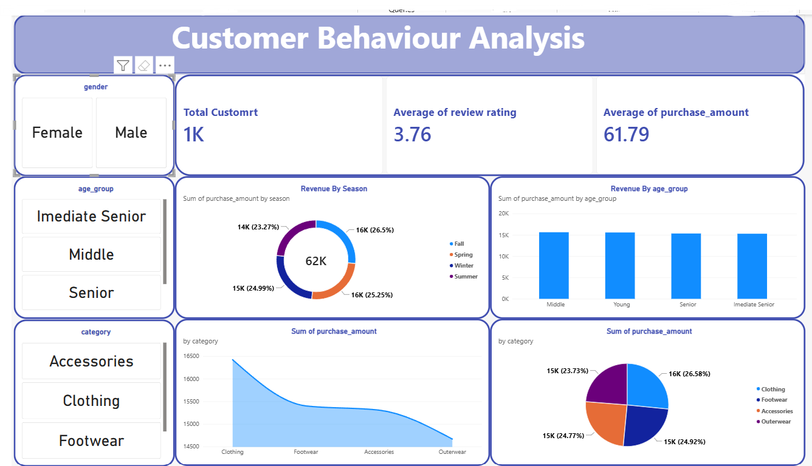

# Customer Behaviour Analysis Dashboard

A comprehensive data analysis pipeline and dashboard built using **Python (Pandas)**, **MySQL**, and **Power BI** to extract, transform, and evaluate consumer spending patterns, purchasing demographics, and product category trends.

---

## 📊 Dashboard Visual Interface

Here is the final interactive dashboard interface showcasing the full breakdown of customer segments:

---

## 📈 Key Metrics & Core KPIs

The dashboard aggregates essential data indicators across the entire dataset, tracking overall consumer behavior and transaction history:

* **Total Customers:** 1,000 (1K)
* **Average Review Rating:** 3.76 / 5.00
* **Average Purchase Amount:** \$61.79 USD
* **Total Aggregated Revenue:** \$62,000 USD (\$62K)

---

## 🔍 Structural Insights & Data Breakdowns

### 1. Revenue Distributions by Season
Analyzed via the primary distribution engine, seasonal tracking indicates stable sales year-round with clear peak cycles:
* **Fall:** Leads total revenue distribution at **26.50%** (~$16K USD).
* **Spring:** Follows closely as the second-highest peak at **25.25%** (~$16K USD).
* **Winter:** Maintains strong consumer interaction patterns at **24.99%** (~$15K USD).
* **Summer:** Accounts for the remaining regular seasonal distribution block at **23.27%** (~$14K USD).

### 2. Category Purchasing Volumes
Product tracking metrics indicate that standard everyday items dictate major volume targets across general shopping behavior:
* **Clothing:** Captures the highest segment share at **26.58%** (~$16K USD).
* **Footwear:** Maintains steady consumer demand at **24.92%** (~$15K USD).
* **Accessories:** Holds regular engagement shares at **24.77%** (~$15K USD).
* **Outerwear:** Accounts for the baseline value at **23.73%** (~$15K USD).

### 3. Revenue Allocations Across Demographic Age Groups
Age tracking highlights distinct operational revenue clusters distributed across age brackets:
* **Middle:** Represents the highest total aggregate volume, outperforming standard segments.
* **Young & Senior:** Hold stable and equal overall purchasing baselines.
* **Immediate Senior:** Accounts for the baseline index volume.

---

## ⚙️ Data Engineering & ETL Pipeline

