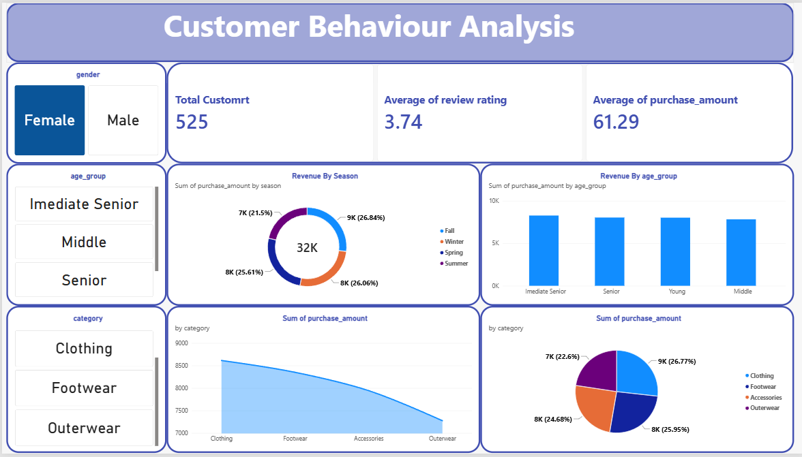

# Customer Behaviour Analysis Dashboard

A comprehensive data analysis dashboard built using **Power BI**, **Python (Pandas)**, and **MySQL** to evaluate and track consumer spending patterns, purchasing demographics, and product category trends.

---

## 📊 Dashboard Visual Interface

Here is the final interactive dashboard interface showcasing the full breakdown of customer segments:

---

## 📈 Key Metrics & Core KPIs

The dashboard aggregates essential data indicators, filtered to dynamically showcase specific segment behavior (currently displaying the **Female** consumer cohort tracking **525 individual profiles**):

* **Total Customers:** 525 
* **Average Review Rating:** 3.74 / 5.00
* **Average Purchase Amount:** \$61.29 USD
* **Total Aggregated Revenue:** \$32,000 USD (\$32K)

---

## 🔍 Structural Insights & Data Breakdowns

### 1. Revenue Distributions by Season
Analyzed via the primary distribution engine, seasonal tracking indicates highly stable sales year-round with clear seasonal spikes:
* **Fall:** Leads total revenue distribution at **26.84%** (~$9K USD).
* **Summer:** Follows closely as the second-highest peak at **26.06%** (~$8K USD).
* **Spring:** Maintains strong consumer interaction patterns at **25.61%** (~$8K USD).
* **Winter:** Accounts for the remaining regular seasonal distribution block at **21.50%** (~$7K USD).

### 2. Category Purchasing Volumes
Product tracking metrics indicate that standard everyday items dictate major volume targets across general shopping behavior:
* **Clothing:** Captures the highest segment share at **26.77%** (~$9K USD).
* **Footwear:** Maintains steady consumer demand at **25.95%** (~$8K USD).
* **Accessories:** Holds regular engagement shares at **24.68%** (~$8K USD).
* **Outerwear:** Accounts for the base segment baseline value at **22.60%** (~$7K USD).

### 3. Revenue Allocations Across Demographic Age Groups
Age tracking highlights distinct operational revenue clusters distributed across age brackets:
* **Immediate Senior:** Represents the highest total aggregate volume, outperforming standard segments.
* **Senior:** Holds the second highest total purchasing index volume.
* **Young & Middle Generations:** Maintain stable and equal overall purchasing baselines.

---

## ⚙️ Technical Project Workflow

